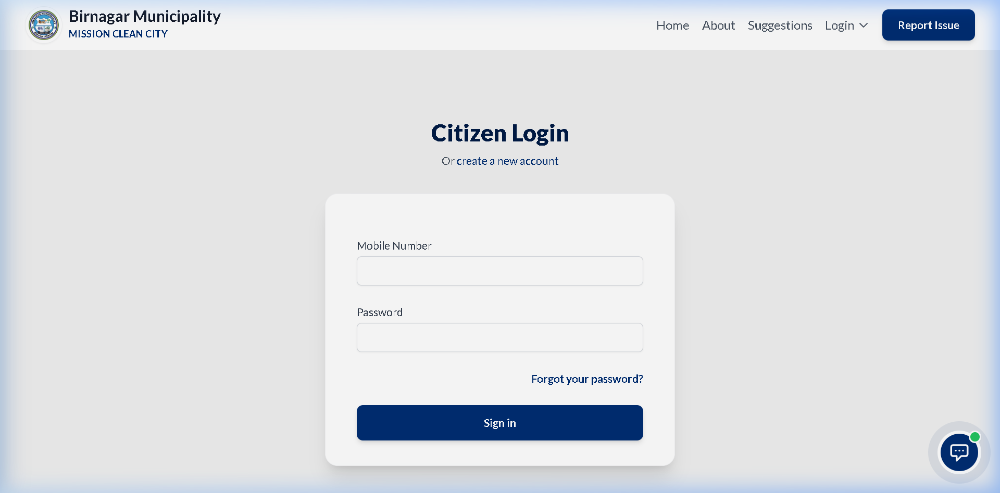
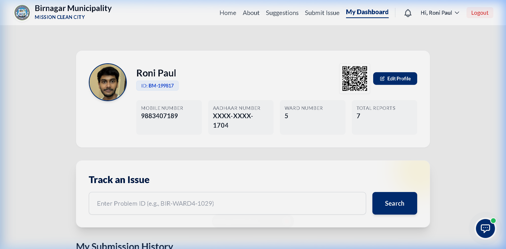
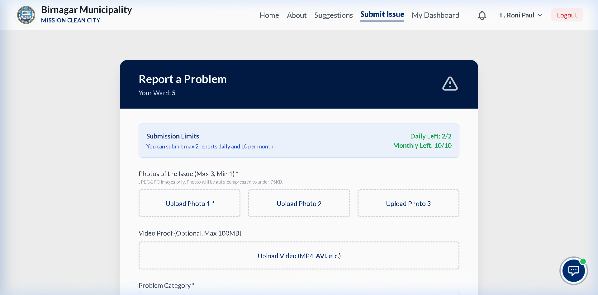
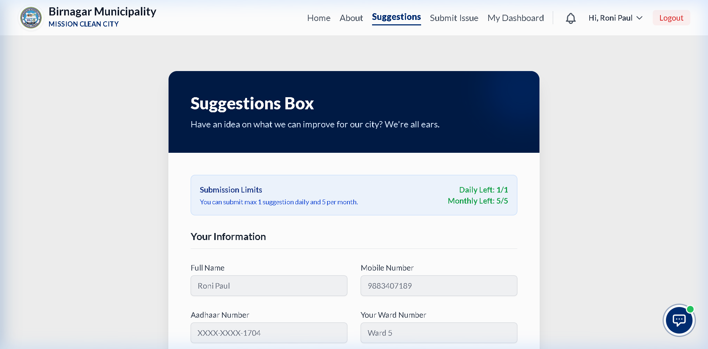
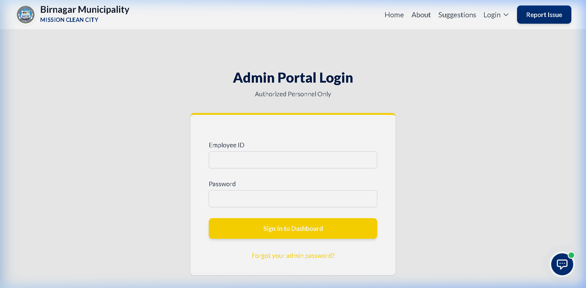
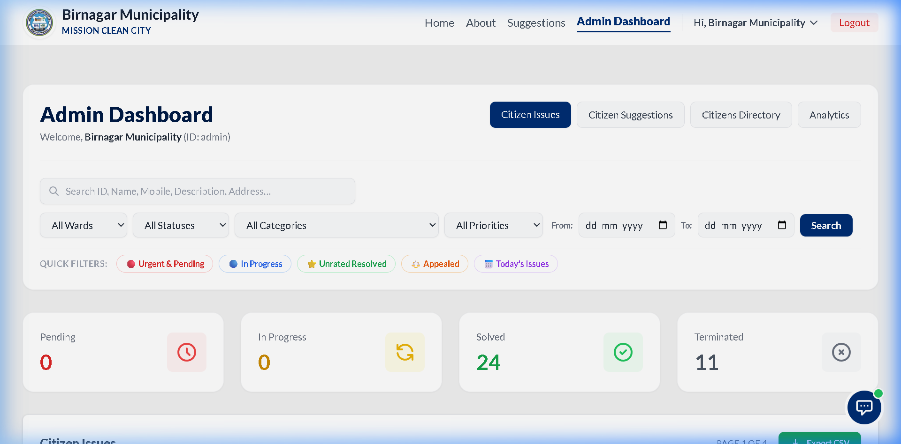

# URBAN CITY CLEAN (MISSION CLEAN CITY)
## Smart Digital Cleanliness Monitoring System for Smart Bengal
*Strategic Project Proposal & Scalability Roadmap*

**Prepared For:** Urban Development Department, Government of West Bengal  
**Current Phase:** Live Prototype (Birnagar Municipality)  
**Future Scope:** Multi-Municipality State-Wide Ecosystem  
**Date:** May 2026  

---

## 1. Project Overview
**Urban City Clean** is a smart digital platform designed to improve city cleanliness and waste management across urban areas of West Bengal. The system helps citizens directly report issues such as:
*   **Garbage dumping**
*   **Dirty roads**
*   **Drainage blockage**
*   **Unclean public areas**
*   **Overflowing dustbins**
*   **Improper waste disposal**
*   **Streetlight issues**
*   **Waterlogging**
*   **Illegal dumping**
*   **Lack of sanitation facilities**
*   **Public health concerns related to cleanliness**
*   **Other cleanliness-related issues**

Through a user-friendly website or mobile platform, citizens can easily upload images and use live location tracking to report problems. These complaints are instantly sent to municipal authorities for faster action and monitoring. 

> [!NOTE] 
> **Technical Context:** This platform is currently operating as a **fully functional prototype** (Mission Clean City) specifically tailored for the Birnagar Municipality. It acts as a centralized, AI-driven Civic Technology platform designed to modernize municipal grievance redressal and replace traditional, disconnected physical ledgers.

---

## 2. Main Objectives
*   **Improve Urban Cleanliness:** Direct community involvement in maintaining hygiene.
*   **Faster Complaint Management:** Transition from paper-based and fragmented complaint systems to a unified digital portal.
*   **Increase Citizen Participation:** Make reporting issues as simple as taking a photo.
*   **Reduce Manual Workload:** Equip administrators with automated dashboards and AI to handle data easily.
*   **Support Smart Bengal:** Align with state-wide Smart City and digital governance initiatives.

---

## 3. How the System Works
The platform ensures a seamless flow of information between the public and the cleaning staff. Below is the step-by-step visual workflow of the system in action.

### 3.1 Citizen Side Workflow
1.  **Secure Login:** Citizens access their accounts using their registered mobile number and password.
    

2.  **Tracking Dashboard:** After login, citizens can see the live status of all their reported issues.
    

3.  **Reporting an Issue:** A simple form allows citizens to upload photos and descriptions, with GPS location captured automatically.
    

4.  **Providing Suggestions:** Citizens can participate in city planning by submitting suggestions for cleanliness improvements.
    

### 3.2 Administrative Side Workflow
1.  **Admin Portal Login:** Municipal staff use their hardened, non-editable Employee IDs to log in.
    

2.  **Command Center Dashboard:** The main dashboard provides a bird's-eye view of all municipal operations, ward-wise analytics, and complaint tracking.
    

---

## 4. Key Features & Technical Implementation
The system successfully bridges the communication gap through a dual-ecosystem tailored for both the public and the administration.

### 4.1 Citizen Side (Public Interface)
*   **Online Complaint Submission & Photo Upload:** Easy-to-use multimedia reporting.
*   **GPS Location Tracking:** Pinpoints the exact location of the issue.
*   **Live Complaint Status:** Citizens can track their complaints (Pending → In Progress → Resolved) in real-time.
*   **Secure Registration:** OTP-based mobile/email verification ensures all users are genuine residents.

### 4.2 Administration Side (Command Center)
*   **Smart Dashboard:** Visual KPIs displaying total complaints, resolution rates, and ward-wise performance.
*   **Complaint & Worker Monitoring:** Ability to manage tasks and generate printable PDF work orders for on-ground staff directly from the portal.
*   **Area-Wise Cleanliness Tracking:** Identifies infrastructure "hotspots" requiring urgent attention.
*   **Hardened Identity Protection:** Administrative identities (Employee ID and Full Name) are locked to prevent internal impersonation. Admins manage profiles via OTP-verified secure workflows.

### 4.3 AI Civic Assistant (Birni AI)
*   **24/7 Chatbot:** Integrated AI assistant (powered by Google Gemini) capable of answering FAQs and guiding users on municipal policies.

---

## 5. Technical Architecture & Security Framework
*For Technical Review Members:*
The platform is built on modern, secure, and scalable technologies capable of handling state-wide traffic.
*   **Backend Framework:** Python / Django (Highly secure and scalable, capable of supporting multi-tenant databases).
*   **AI Integration:** Google Gemini NLP models.
*   **Hardened Authentication:** Multi-factor authentication (MFA) via OTP for all critical account modifications.
*   **Identity Protection:** Sensitive citizen data (such as Aadhaar numbers) is encrypted at rest using Advanced Symmetric Encryption (Fernet).
*   **Automated Credential Dispatch:** Credentials for administrative staff are dispatched via encrypted official email, ensuring strict Role-Based Access Control (RBAC).

### 5.1 Key Security & Administrative Workflows
*   **Admin Identity Hardening:** Every Administrator is assigned a unique `Employee ID` at registration. This ID and their `Full Name` are locked at the database level and cannot be modified by the user, preventing internal identity fraud.
*   **Secure Email Modification:** Any change to an administrative email address requires mandatory 6-digit OTP verification sent to the *new* email address before the change is committed.
*   **Isolated Password Recovery:** The system maintains separate, cryptographically secure recovery pipelines for Citizens and Administrators to prevent cross-account attacks.

---

## 6. Benefits of the Project
*   **Faster response** to public complaints.
*   **Cleaner urban environment** and healthier communities.
*   **Transparent monitoring system** that builds confidence in local government.
*   **Better communication** between citizens and municipality staff.
*   **Optimized Budgeting:** Analytics allow municipalities to deploy funds exactly where infrastructure is failing.

---

## 7. Future Scope & Scalability
The architecture of the prototype was engineered to facilitate rapid expansion to build a massive state-wide infrastructure.
*   **State-Wide Monitoring System (SaaS Model):** A single platform capable of hosting multiple municipalities simultaneously (e.g., Ranaghat, Krishnanagar) with complete data isolation for each.
*   **Mobile Application:** Transitioning from a web portal to dedicated, native **Android and iOS applications** with offline-mode capabilities.
*   **IoT Smart Dustbin Integration:** Future compatibility to connect with physical smart bins that automatically alert the municipality when full.
*   **Advanced Admin Workstations:** The Admin portal will remain strictly optimized for Laptop/Desktop environments to efficiently manage GIS mapping and large datasets.

---

## 8. Conclusion
**Urban City Clean** (Mission Clean City) is a modern technology-based initiative aimed at building a cleaner, smarter, and healthier West Bengal. This platform can help municipalities improve waste management efficiency while encouraging active citizen participation in maintaining city cleanliness. By transitioning this prototype into a Multi-Municipality platform, the Urban Development Department has the opportunity to establish a new gold standard for proactive civic administration.

---
**Developed By:**  
**Roni Paul**  
West Bengal, India
