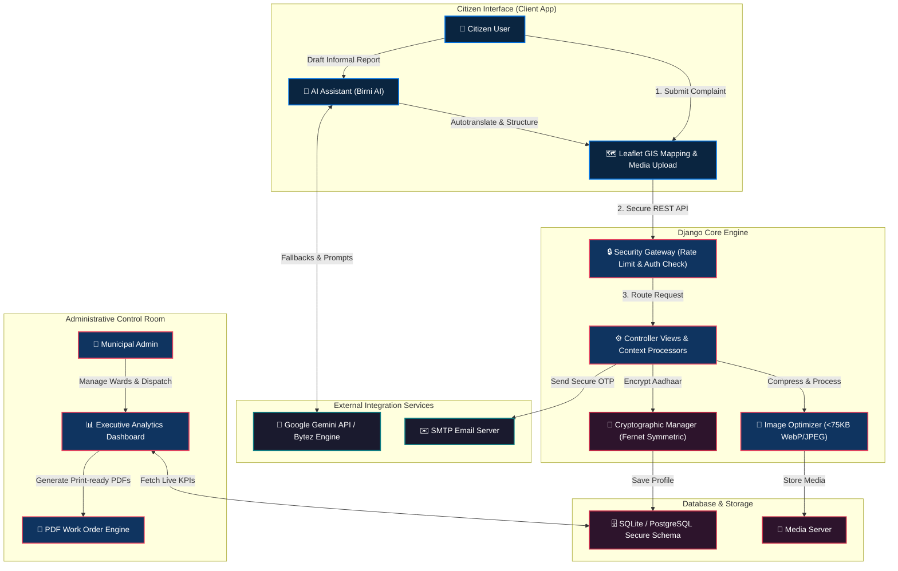

# 🏙️ Mission Clean City — Birnagar Municipality

> **An Elite, AI-Augmented Civic Governance & Urban Cleanliness Platform for the Smart Birnagar Municipality (Nadia, West Bengal)**

---

[](https://www.python.org/)
[](https://www.djangoproject.com/)
[](https://deepmind.google/technologies/gemini/)
[](#gis--visual-infrastructure)
[](#-cryptographic-security--privacy)

**Mission Clean City** is a state-of-the-art civic management platform custom-built to support the **"Nirmal Bangla"** vision in the **Birnagar Municipality (14 Wards, Nadia District, West Bengal)**. By merging an intuitive GIS interface, robust cryptographic encryption, automated diagnostic tests, and an advanced AI engine, the platform bridges the gap between citizens and municipal administrators, turning citizen feedback into professional urban action.

---

## 🗺️ System Architecture

The following diagram illustrates the flow of data, API integrations, and security enforcement across the platform:



---

## 💎 Elite Platform Modules

### 1. 🤖 The Intelligent Core (Birni AI)
* **AI Writing Assistant:** Converts informal, localized, or grammatically raw citizen reports into formal, structured, municipal-grade incident dispatches automatically utilizing the ultra-fast **Google Gemini 1.5 Flash** model.
* **24/7 Citizen Copilot:** Built-in interactive chatbot pre-loaded with knowledge about Birnagar's 14 wards, local contact directories, civic policies, and problem-reporting guidelines.
* **Resilient Dual-Path Pipeline:** Intelligent failover mechanism utilizing the Bytez Unified API as the primary path with a robust direct SDK connection to Google Gemini for 100% service availability.

### 2. 🗺️ High-Precision GIS & Media Processing
* **Interactive Incident Pinning:** A customizable, mobile-friendly **Leaflet.js** map allowing citizens to drop a precise pin on the geographical location of the issue.
* **Automated Geocoding:** Reverse-geocodes coordinate pins into human-readable locations automatically to eliminate confusion for field teams.
* **Smart Media Pipelines:** Automatic multi-threaded image optimization and compression (ensuring all uploaded incident photos are under 75KB) to conserve municipal storage.

### 3. 🔒 Cryptographic Security & Privacy (Pro Grade)
* **Aadhaar Encryption:** All citizen-entered Aadhaar numbers are fully protected using state-of-the-art **Fernet Symmetric Cryptography (AES-128 in CBC mode)** before database writes.
* **Zero-Downtime Key Rotation:** Embedded utilities that support rotating the encryption key periodically without interrupting access to legacy data.
* **SMTP OTP Authentication:** Fully automated OTP generator for high-risk operations including new citizen registrations, password resets, and email modifications.
* **Session Rate-Limiting:** Active brute-force protection, login trial limiters, and file size gatekeepers to secure system endpoints.

### 4. 📈 Executive Control Tower (Admin Dashboard)
* **Ward-Wise Analytical KPIs:** High-density, gorgeous UI dashboard rendering active visual charts (**Chart.js**) for resolved vs. pending ratios across all 14 administrative wards.
* **Print-Ready Work Orders:** Generate professional, high-impact PDF work orders for local ward workers with one click.
* **Dynamic Cache Layering:** Custom cache invalidation protocols that instantly rebuild administrative metrics upon new complaint filings or status updates.

---

## 🛠️ Technical Stack

| Category | Technology | Purpose |
| :--- | :--- | :--- |
| **Backend Framework** | Django 5.0.x / Python 3.11+ | Robust, secure MVC core architecture |
| **Database** | SQLite3 (Development) / PostgreSQL (Prod Support) | Encrypted storage & relational schema |
| **AI Integration** | Google Gemini 1.5 / Bytez API | Natural language processing & chat systems |
| **Frontend Layout** | Vanilla ES6+ JS / Tailwind Design System / CSS3 | Modern aesthetics, Glassmorphism, animations |
| **Mapping Engine** | Leaflet.js / OpenStreetMap Tiles | Precise coordinate collection & visual maps |
| **Cryptography** | Cryptography.io (Fernet / AES-128) | High-security Aadhaar at-rest protection |
| **Automation & Tests**| Django UnitTestCase / SMTP Mock Layer | Comprehensive endpoint verification |

---

## 📂 Project Directory Structure

```text
mission-clean-city/
├── config/                  # Django project configuration
│   ├── settings.py          # Production & dev security configurations
│   ├── urls.py              # Root routing table & custom error page links
│   └── wsgi.py              # Application entry point
├── core/                    # Core business logic & models
│   ├── admin.py             # Django admin customizations
│   ├── email_service.py     # Production-grade SMTP/Gmail handler
│   ├── image_processor.py   # High-performance image compressors
│   ├── models.py            # SQLite/PostgreSQL relational schemas
│   ├── tests.py             # Automated unit & integration tests
│   ├── utils.py             # Encryption, key rotation & AI fallback logic
│   └── views.py             # Core controller views (80+ functionalities)
├── templates/               # Premium HTML templates
│   ├── base.html            # Premium glassmorphism base layout
│   ├── home.html            # Vibrant homepage with live statistics & AI chatbot
│   ├── admin_analytics.html # High-density charts & analytics panel
│   └── errors/              # Branded 400, 403, 404, 500 custom error pages
├── static/                  # Static assets
│   ├── css/                 # Custom styling overlays
│   └── images/              # Leaf pattern vectors & logo designs
├── manage.py                # Command-line administrative utility
├── requirements.txt         # Package dependencies file
└── README.md                # System documentation
```

---

## 🚀 Setup & Local Launch

Follow these standard steps to build, migrate, and run the project locally on your system:

### 1. Repository Setup & Environment Provisioning
Clone the repository and spin up a Python virtual environment:
```bash
# Clone the repository
git clone https://github.com/ronipaul2021/mission-clean-city-birnagar-municipality.git
cd mission-clean-city-birnagar-municipality

# Create a virtual environment
python -m venv venv

# Activate the virtual environment
# Windows:
.\venv\Scripts\activate
# macOS/Linux:
source venv/bin/activate

# Install all critical packages
pip install -r requirements.txt
```

### 2. Environment Configuration
Create a `.env` file in the root workspace directory with the following variables:
```env
# General
SECRET_KEY=django-secure-randomized-key-here
DEBUG=True

# AI API Configurations
BYTEZ_API_KEY=your_bytez_endpoint_key
GEMINI_API_KEY=your_direct_google_gemini_key

# Production Mail Service (SMTP Client)
EMAIL_HOST_USER=your-verified-email@gmail.com
EMAIL_HOST_PASSWORD=your-secure-app-password
DEFAULT_FROM_EMAIL=your-verified-email@gmail.com

# Cryptographic Keys (Must be a 32-byte url-safe base64 key)
# Run `python -c "from cryptography.fernet import Fernet; print(Fernet.generate_key().decode())"`
AADHAAR_ENCRYPTION_KEY=your_generated_fernet_key
```

### 3. Database Initialization & Setup
Run the database migrations and create an administrator superuser:
```bash
# Execute model structure setup
python manage.py migrate

# Create your primary administrative superuser
python manage.py createsuperuser

# Spin up the local development server
python manage.py runserver
```
*Open your browser and navigate to `http://127.0.0.1:8000/`.*

---

## 🧪 Comprehensive Quality Assurance

The platform features an automated quality-assurance test suite covering model constraints, views, cache engines, error routers, and security.

Run the test suite using:
```bash
python manage.py test
```

All 12 critical integrations should pass with `OK`:
```text
System check identified no issues (0 silenced).
Creating test database for alias 'default'...
Ran 12 tests in 7.12s
OK
Destroying test database for alias 'default'...
```

---

## 🏛️ Governmental & Municipality Alignment
This platform is strategically engineered to comply with all technical guidelines of the national **"Swachh Bharat Abhiyan"** and state-wide **"Nirmal Bangla"** campaigns. By keeping citizens at the core of the reporting loop and providing officials with high-density tracking dashboards, Birnagar remains a regional leader in digital governance and civic care.

---

**Developed for Birnagar Municipality** | *Empowering Citizens, Enabling Administration.*
